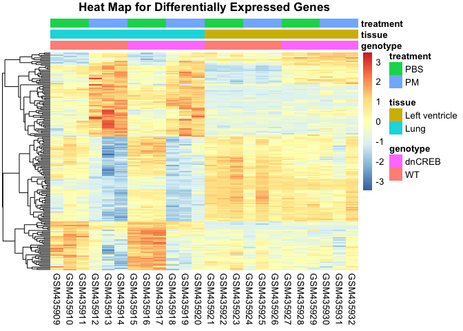
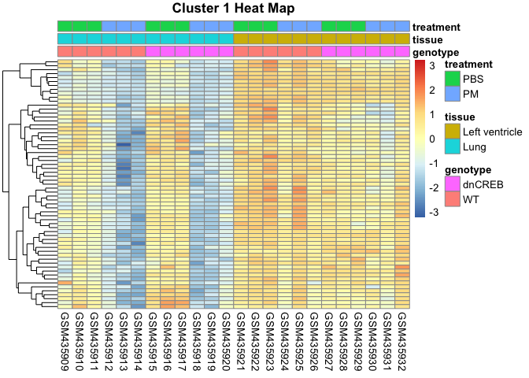
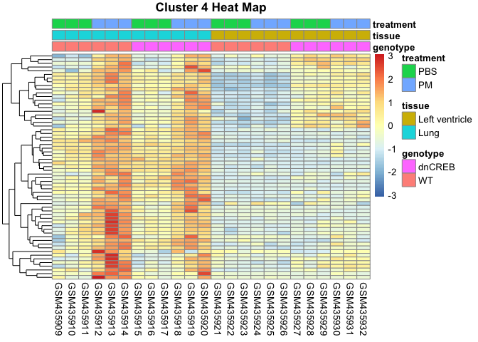
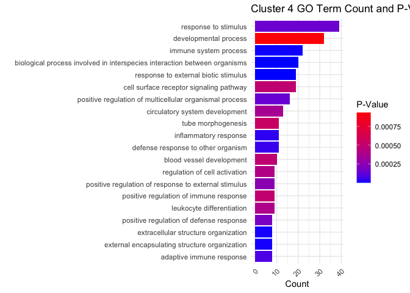

# DGE Analysis of Particulate Matter effect on Mouse Model of Cardiac Failure

### Abstract

This study investigates the effects of particulate matter (PM) on gene expression in lung and left ventricle tissues in mouse models designed based on human congestive heart failure (CHF). Through normalization and analysis methods, 178 differentially expressed genes (DEGs) are identified and clustered to understand expression patterns and biological implications. The resulting heatmaps reveal significant and, interestingly, contrasting patterns in gene expression. One cluster illustrates an upregulation in PM in lung tissue whereas the other has a downregulation patter. GO-term analysis revealed that the top GO-term analysis from the top two clusters were cellular regulation and immune system processes. As a result, the analysis shows that PM disrupt critical cellular activities and cause developmental changes. These findings offer insights into potential therapeutic targets for mitigating the effects of air pollution on vulnerable populations with CHF. This study is instrumental in understanding why individuals with CHF are particularly vulnerable to PM and brings to attention a larger public health concern — the substantive detrimental effects of air pollution.

### Introduction
The negative effect of particulate matter (PM) on cardiovascular health has been apparent for decades. PM has the ability to cause inflammation, lead to blood clots, change the body’s automatic controls such as heart rate. Previous rat models have shown that PM directly slows the heart rate, prompting an increase in the possibility of an arrhythmia occurring. However, though there is an understanding of PM’s cardiac effects, it is not known through what mechanisms PM affects the heart. And so, this research in particular questions the process that PM employs to impact heart health, especially in individuals with congestive heart failure (CHF) since their nervous system has the propensity to overreact as a byproduct of increased sensitivity in the carotid body in CHF patients. The effects of PM on lung tissues is also observed since this reveals PM’s direct impact on respiratory function health, which is closely linked to cardiac function.

To answer this question, a mouse model genetically modified to mimic human CHF (CREBA133) was generated to reveal how PM exposure exacerbates heart problems.1 These results were compared to normal CD1 mice—a standard laboratory strain. The two types were then given either PM or PBS—a harmless solution— to examine the effects on lung tissues and the Left Ventricle. The resulting Affymetrix microarray data is then analyzed through heatmaps and GO-term analysis, which are expected to highlight specific genes and pathways that are altered significantly in response to PM on the mice. Ideally, heatmaps will show obvious contrasting upregulation and dysregulation patterns based on treatment and genotype. This would indicate that PM directly affects the heart, amongst other conclusions. The GO-term analysis will illustrate a connection between the dysregulated genes and the enrichment of relevant biological processes, displaying how PM interacts with cellular processes to magnify CHF symptoms. Finding significant genes can identify potential therapeutic targets to mitigate the harmful effects of PM. Overall, the results of this study address public health safety by placing more emphasis on the need to develop strategies to protect vulnerable populations, like those with CHF, from the harmful effects of air pollution.

### Results
#### Normalization
Normalization is a vital step to analyzing data to ensure that the results are accurate and reliable since it can correct variations that were the result of artifacts, for instance. After loading the data, RMA was used for normalization because it is more robust than other normalization methods. It incorporates background adjustment for low-intensity signals and quantile normalization to equalize data distribution across arrays. 

It is important to look at the distribution of data to confirm that the data is normalized. Figure 1 from the appendix illustrates the boxplots that were generated to showcase the expression intensities for the data after normalization. The boxplots are all similar to one another, with nearly identical interquartile ranges, medians, and outliers, indicating that the data is successfully normalized. Figure 2 is a histogram that was created to remove genes with low expression. When looking at the graph of the normalized values, the cutoff was determined to be at 5 to get rid of any further noisy levels.

Figure 1. Boxplots of RMA-normalized expression intensities for 24 chips highlight consistency post-normalization.

Figure 2. Histogram of Distribution of Normalized Gene Expression Values with Low Expression Cutoff. 

#### Identify Differentially Expressed Genes 
Identifying differentially expressed genes is necessary to find the specific genes that are associated with the research question at hand. This information is also necessary for the next step—clustering, which requires DEGs to be able to group genes. 

There are 24 chips in this data and the following are the 8 groups with 3 replicates each for the two mouse types (CREBA133 and CD1): WT+PBS in Lung, WT+PM in Lung, WT+PBS in LV, WT+PM in LV, CD-1 dominant negative+PBS in Lung, CD-1 dominant negative+PM in Lung, CD-1 dominant negative+PBS in LV, CD-1 dominant negative+PM in LV. Therefore, the three key factors in this study: genotype (WT and CD-1 dominant negative, which refers to CD1 and CREBA133, respectively), tissue (Lung and Left Ventricle), and treatment (with PBS or PM).

With this information, we performed ANOVA analysis with aov to identify the differentially expressed genes due to the type of tissue, treatment, genotype, or interaction between them. The resulting p-values are adjusted for multiple hypothesis testing using FDR correction to increase the reliability of the results since this method reduces the likelihood of false positives (type I errors) in order to ensure that the results are not due to chance. There are 1227 genes whose adjusted p-values pass the 0.05 cutoff. 

Then the genes with significant fold change were calculated to find genes that have significant changes in gene expression levels, which can indicate that they are functionally relevant. According to the appendix, 270 genes had a log fold change equal to or greater than the 1.5 threshold. The 1.5-log fold change threshold is necessary to identify the genes that have significant changes in expression levels.

We identified a total of 178 DEGs by filtering out genes with adjusted p-values less than 0.05 and log fold change greater than 1.5.
	

#### Cluster Differentially Expressed Genes
Clustering differentially expressed genes is vital because it groups genes that exhibit similar expression patterns. And so, it helps get an idea of how certain groups of genes may contribute to certain symptoms/effects of a condition. In this case, clustering aids in understanding which gene pathways are present and able to cause significant effects on cellular processes. Clustering is done by performing Pearson’s correlation with the differentially expressed genes to calculate distance. As can be seen in Figure 3, there are some dominant and other extremely short groups. So, the cutree function was used to break up the clusters into more manageable and distinct clusters. Based on Figure 4, the optimal clustering is 4 groups where average silhouette width is a local minima. The largest clusters had 63 and 61 genes, corresponding to cluster 1 and cluster 4.
Three heatmaps were constructed to reveal expression patterns. Figure 5 is the generated heatmap for all of the differentially expressed genes whereas Figure 6 and Figure 7 are only for clusters 1 and 4, respectively. The most significant observation from Figure 5 is that genes are downregulated in the wild type mice in the left ventricle, and are slightly less downregulated in the CREBA133 mice. On average, there is upregulation in the lung and dysregulation in the left ventricle.

Figure 3. Cluster dendrogram reveals some dominant and other extremely short groups.  

Figure 4. Average silhouette width by index.

Figure 5. Heatmap for all differentially expressed genes.

Figure 6. Heatmap for cluster 1.

Figure 7. Heatmap for cluster 4.

#### GO-term analysis of differentially expressed genes and or clusters
GO-term analysis is done to identify the biological processes that the differentially expressed genes are involved with, and whether these processes are a result of exposure to particulate matter (PM). Using the annotation package mouse4302.db, we obtain a list of universal genes to be matched with our list of differentially expressed genes. We provide GoHyperGParams with our gene lists, annotation package and “BP” as the interested ontology, at the value Cutoff at 0.01. The result is a list of GO terms for overrepresented genes. The top GO terms for cluster 1 (Figure 8) relate to cellular regulation and response to inorganic and organic compounds, whereas the top GO terms for cluster 4 (Figure 9) involve response to stimulus and immune system process regulation.

Figure 8. GO-Term analysis of cluster 1 relates to cellular regulation and response processes.

Figure 9. GO-Term analysis of cluster 4 reveals gland morphogenesis and reproductive process regulation.

### Discussion
From this analysis, we learned that the top GO-terms for the differentially expressed genes and the clusters shown in Figure 8 and 9 were related to the general biogical processes and the respiratory system, in agreement with the the context of this paper. Figure 8 reveals that the top GO-terms for cluster 1 are centered around egulating cellular metabolic processes, stress responses, immune signaling, ion transport, and tissue repair mechanisms. This signifies that particulate matter can hinder fundamental cellular activities including response to nitrogen compounds that allow normal cardiovascular function among CHF patients. Figure 9 shows cluster 4's involvement in regulating immune responses, defense mechanisms, extracellular structure organization, and cellular interactions with external organisms, particularly in the context of inflammation and pathogen defense. These GO-terms support that PM interferes with cell's normal function resulting in inflammatory reactions.

The data analysis offers numerous insights into how exactly PM influences gene expression in the lung and left ventricle tissues. For instance, based on the conclusions drawn from Figure 6, genes in cluster 4 that are usually expressed in normal conditions, are instead downregulated when the lung tissue is exposed to PM. These genes are responsible for regulating metabolism, signal transduction, stress responses, and transport processes in cells. Their downregulation suggests a widespread suppression of vital functions, leading to impaired metabolism, reduced cellular response to damage, weakened immune and detoxification pathways, and hindered tissue repair in lung tissue exposed to particulate matter. From Figure 7, it can be hypothesized that the genes in cluster 4 are responsible for biological responses in the lung tissue when it is exposed to PM. Their upregulation suggests an intensified activation of both innate and adaptive immunity as the lung tissue reacts to the harmful effects of PM. 

The paper that published this dataset shows significant dysregulation in sodium (Na+) and potassium (K+) channels, leading to hyperexcitability of cardiac and carotid body cells. This is consistent with GO terms related to metal ion transport regulation and cellular response to stimulus in cluster 1, which are important for maintaining ion balance and responding to environmental stressors like PM. The upregulation of cluster 4 genes involved in the inflammatory response in your cluster, especially those tied to immune system activation, aligns with the paper's emphasis on increased inflammatory cascades triggered by PM. This exacerbates cardiovascular conditions, mirroring our findings on immune and inflammatory process regulation. In conclusion, our DGE analysis confirms the findings of the paper that particulate matter exposure leads to dysregulated ion transport, inflammatory responses, and disrupted cellular metabolism, contributing to the adverse health effects seen in cardiac and respiratory tissues.

### References

Wang T, Lang GD, Moreno-Vinasco L, Huang Y et al. Particulate matter induces cardiac arrhythmias via dysregulation of carotid body sensitivity and cardiac sodium channels. Am J Respir Cell Mol Biol 2012 Apr;46(4):524-31. PMID: 22108299.
