Particulate Matter effect on Mouse Model of Cardiac Failure: Lung and
Heart Left Ventricle
================
Krysten Nguyen and Bindu Koyi

## Reference Paper

<https://www.ncbi.nlm.nih.gov/geo/query/acc.cgi?acc=GSE17478>

## Load packages

`{r: load initial packages} install.packages("BiocManager") BiocManager::install("GEOquery") library(GEOquery) library(BiocManager)`
\## Load data

``` r
gse<-GEOquery::getGEO("GSE17478")
```

    ## Setting options('download.file.method.GEOquery'='auto')

    ## Setting options('GEOquery.inmemory.gpl'=FALSE)

    ## Found 1 file(s)

    ## GSE17478_series_matrix.txt.gz

``` r
dataset = gse$GSE17478_series_matrix.txt.gz
```

Get information on samples and store in expdesign

``` r
sample = dataset$geo_accession
tissue = dataset$source_name_ch1
dataset$treatment_protocol_ch1
```

    ##  [1] "PBS"                                                         
    ##  [2] "PBS"                                                         
    ##  [3] "PBS"                                                         
    ##  [4] "20mg/kg 1.9µm particulate matter, lung harvest after 36 hour"
    ##  [5] "20mg/kg 1.9µm particulate matter, lung harvest after 36 hour"
    ##  [6] "20mg/kg 1.9µm particulate matter, lung harvest after 36 hour"
    ##  [7] "PBS"                                                         
    ##  [8] "PBS"                                                         
    ##  [9] "PBS"                                                         
    ## [10] "20mg/kg 1.9µm particulate matter, lung harvest after 36 hour"
    ## [11] "20mg/kg 1.9µm particulate matter, lung harvest after 36 hour"
    ## [12] "20mg/kg 1.9µm particulate matter, lung harvest after 36 hour"
    ## [13] "PBS"                                                         
    ## [14] "PBS"                                                         
    ## [15] "PBS"                                                         
    ## [16] "20mg/kg 1.9µm particulate matter, lung harvest after 36 hour"
    ## [17] "20mg/kg 1.9µm particulate matter, lung harvest after 36 hour"
    ## [18] "20mg/kg 1.9µm particulate matter, lung harvest after 36 hour"
    ## [19] "PBS"                                                         
    ## [20] "PBS"                                                         
    ## [21] "PBS"                                                         
    ## [22] "20mg/kg 1.9µm particulate matter, lung harvest after 36 hour"
    ## [23] "20mg/kg 1.9µm particulate matter, lung harvest after 36 hour"
    ## [24] "20mg/kg 1.9µm particulate matter, lung harvest after 36 hour"

``` r
# condense treatment description
treatment = rep(c(rep("PBS",3), rep("PM",3)), 4)
dataset$`genotype:ch1`
```

    ##  [1] "Wild type"                                                                                 
    ##  [2] "Wild type"                                                                                 
    ##  [3] "Wild type"                                                                                 
    ##  [4] "Wildtype"                                                                                  
    ##  [5] "Wildtype"                                                                                  
    ##  [6] "Wildtype"                                                                                  
    ##  [7] "dominant negative CREB1 driven by cardiomyocyte-specific myosin heavy chain-alpha promoter"
    ##  [8] "dominant negative CREB1 driven by cardiomyocyte-specific myosin heavy chain-alpha promoter"
    ##  [9] "dominant negative CREB1 driven by cardiomyocyte-specific myosin heavy chain-alpha promoter"
    ## [10] "dominant negative CREB1 driven by cardiomyocyte-specific myosin heavy chain-alpha promoter"
    ## [11] "dominant negative CREB1 driven by cardiomyocyte-specific myosin heavy chain-alpha promoter"
    ## [12] "dominant negative CREB1 driven by cardiomyocyte-specific myosin heavy chain-alpha promoter"
    ## [13] "Wild type"                                                                                 
    ## [14] "Wild type"                                                                                 
    ## [15] "Wild type"                                                                                 
    ## [16] "Wildtype"                                                                                  
    ## [17] "Wildtype"                                                                                  
    ## [18] "Wildtype"                                                                                  
    ## [19] "dominant negative CREB1 driven by cardiomyocyte-specific myosin heavy chain-? promoter"    
    ## [20] "dominant negative CREB1 driven by cardiomyocyte-specific myosin heavy chain-? promoter"    
    ## [21] "dominant negative CREB1 driven by cardiomyocyte-specific myosin heavy chain-? promoter"    
    ## [22] "dominant negative CREB1 driven by cardiomyocyte-specific myosin heavy chain-? promoter"    
    ## [23] "dominant negative CREB1 driven by cardiomyocyte-specific myosin heavy chain-? promoter"    
    ## [24] "dominant negative CREB1 driven by cardiomyocyte-specific myosin heavy chain-? promoter"

``` r
# condense genotype description
genotype = c(rep("WT", 6), rep("dnCREB", 6), rep("WT", 6), rep("dnCREB", 6))

expdesign = data.frame(sample, genotype, tissue, treatment)
row.names(expdesign) = expdesign$sample
expdesign
```

    ##              sample genotype         tissue treatment
    ## GSM435909 GSM435909       WT           Lung       PBS
    ## GSM435910 GSM435910       WT           Lung       PBS
    ## GSM435911 GSM435911       WT           Lung       PBS
    ## GSM435912 GSM435912       WT           Lung        PM
    ## GSM435913 GSM435913       WT           Lung        PM
    ## GSM435914 GSM435914       WT           Lung        PM
    ## GSM435915 GSM435915   dnCREB           Lung       PBS
    ## GSM435916 GSM435916   dnCREB           Lung       PBS
    ## GSM435917 GSM435917   dnCREB           Lung       PBS
    ## GSM435918 GSM435918   dnCREB           Lung        PM
    ## GSM435919 GSM435919   dnCREB           Lung        PM
    ## GSM435920 GSM435920   dnCREB           Lung        PM
    ## GSM435921 GSM435921       WT Left ventricle       PBS
    ## GSM435922 GSM435922       WT Left ventricle       PBS
    ## GSM435923 GSM435923       WT Left ventricle       PBS
    ## GSM435924 GSM435924       WT Left ventricle        PM
    ## GSM435925 GSM435925       WT Left ventricle        PM
    ## GSM435926 GSM435926       WT Left ventricle        PM
    ## GSM435927 GSM435927   dnCREB Left ventricle       PBS
    ## GSM435928 GSM435928   dnCREB Left ventricle       PBS
    ## GSM435929 GSM435929   dnCREB Left ventricle       PBS
    ## GSM435930 GSM435930   dnCREB Left ventricle        PM
    ## GSM435931 GSM435931   dnCREB Left ventricle        PM
    ## GSM435932 GSM435932   dnCREB Left ventricle        PM

## 1. Normalization

Using affy package to normalize Affymetrix microarray data

``` r
BiocManager::install("affy")
```

    ## Bioconductor version 3.18 (BiocManager 1.30.22), R 4.3.1 (2023-06-16)

    ## Warning: package(s) not installed when version(s) same as or greater than current; use
    ##   `force = TRUE` to re-install: 'affy'

    ## Old packages: 'BH', 'Biostrings', 'boot', 'brio', 'bslib', 'callr', 'cli',
    ##   'codetools', 'commonmark', 'curl', 'data.table', 'DBI', 'dbplyr', 'desc',
    ##   'DESeq2', 'digest', 'DT', 'emmeans', 'estimability', 'FactoMineR', 'fansi',
    ##   'GenomeInfoDb', 'ggplot2', 'ggrepel', 'glue', 'htmltools', 'httpuv',
    ##   'igraph', 'knitr', 'lattice', 'lme4', 'locfit', 'MASS', 'Matrix',
    ##   'matrixStats', 'metafor', 'mgcv', 'multcompView', 'munsell', 'pkgbuild',
    ##   'pkgload', 'processx', 'promises', 'ps', 'R.oo', 'ragg', 'Rcpp',
    ##   'RcppArmadillo', 'RcppEigen', 'RCurl', 'readr', 'reprex', 'rlang',
    ##   'rmarkdown', 'RSQLite', 'rstudioapi', 'rvest', 'S4Arrays', 'sass', 'sp',
    ##   'SparseArray', 'stringi', 'survival', 'systemfonts', 'tidyr', 'tidyselect',
    ##   'timechange', 'tinytex', 'uuid', 'withr', 'xfun', 'XML', 'yaml', 'zlibbioc'

``` r
library(affy)
```

    ## Loading required package: BiocGenerics

    ## 
    ## Attaching package: 'BiocGenerics'

    ## The following objects are masked from 'package:stats':
    ## 
    ##     IQR, mad, sd, var, xtabs

    ## The following objects are masked from 'package:base':
    ## 
    ##     anyDuplicated, aperm, append, as.data.frame, basename, cbind,
    ##     colnames, dirname, do.call, duplicated, eval, evalq, Filter, Find,
    ##     get, grep, grepl, intersect, is.unsorted, lapply, Map, mapply,
    ##     match, mget, order, paste, pmax, pmax.int, pmin, pmin.int,
    ##     Position, rank, rbind, Reduce, rownames, sapply, setdiff, sort,
    ##     table, tapply, union, unique, unsplit, which.max, which.min

    ## Loading required package: Biobase

    ## Welcome to Bioconductor
    ## 
    ##     Vignettes contain introductory material; view with
    ##     'browseVignettes()'. To cite Bioconductor, see
    ##     'citation("Biobase")', and for packages 'citation("pkgname")'.

Getting raw Affymetrix data from NCBI GEO’s website

``` r
download.file("https://www.ncbi.nlm.nih.gov/geo/download/?acc=GSE17478&format=file","GSE17478_RAW.tar")
untar("GSE17478_RAW.tar")
```

Getting a list of files to be normalized:

``` r
cel_files = dir(path=".", pattern=".CEL.gz")
cel_files
```

    ##  [1] "GSM435909.CEL.gz" "GSM435910.CEL.gz" "GSM435911.CEL.gz" "GSM435912.CEL.gz"
    ##  [5] "GSM435913.CEL.gz" "GSM435914.CEL.gz" "GSM435915.CEL.gz" "GSM435916.CEL.gz"
    ##  [9] "GSM435917.CEL.gz" "GSM435918.CEL.gz" "GSM435919.CEL.gz" "GSM435920.CEL.gz"
    ## [13] "GSM435921.CEL.gz" "GSM435922.CEL.gz" "GSM435923.CEL.gz" "GSM435924.CEL.gz"
    ## [17] "GSM435925.CEL.gz" "GSM435926.CEL.gz" "GSM435927.CEL.gz" "GSM435928.CEL.gz"
    ## [21] "GSM435929.CEL.gz" "GSM435930.CEL.gz" "GSM435931.CEL.gz" "GSM435932.CEL.gz"

``` r
# read in Affymetric microarray data files
affy_batch = affy::ReadAffy(filenames = cel_files)
# MAS5 calls to indicate probe intensities in data
affy_calls = affy::mas5calls(affy_batch)
```

    ## Getting probe level data...

    ## Warning: replacing previous import 'AnnotationDbi::tail' by 'utils::tail' when
    ## loading 'mouse4302cdf'

    ## Warning: replacing previous import 'AnnotationDbi::head' by 'utils::head' when
    ## loading 'mouse4302cdf'

    ## 

    ## Computing p-values
    ## Making P/M/A Calls

``` r
# graph histogram of Present (P) calls and keep the probesets with "P" calls >= 10
affy_calls_values = exprs(affy_calls)
totalP = rowSums(affy_calls_values=="P")
hist(totalP, )
```

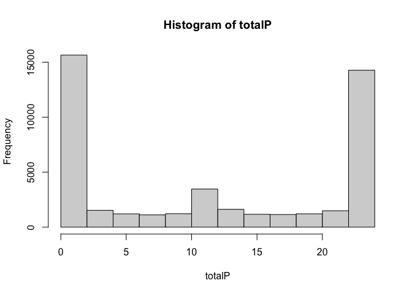<!-- -->

``` r
keep = rownames(affy_calls_values[totalP>=10,])
```

We use RMA for normalization. RMA is more robust than other
normalization methods for Affymetrix microarray, including MAS5. - RMA
incorporates background correction and quantile normalization that
equalizes data distribution across arrays - RMA uses median polish
procedure to calculate summary values, making it less sensitive to
outliers - RMA provides log transformed expression values

``` r
library(affy)
rma_eset = rma(affy_batch, subset = keep)
```

    ## Background correcting
    ## Normalizing
    ## Calculating Expression

``` r
# get normalized expression value
rma_expvalues=exprs(rma_eset)

head(rma_expvalues)
```

    ##              GSM435909.CEL.gz GSM435910.CEL.gz GSM435911.CEL.gz
    ## 1415670_at           8.512785         9.246297         9.183935
    ## 1415671_at          10.927567        11.113723        11.207563
    ## 1415672_at          11.586619        11.472784        11.546167
    ## 1415673_at           8.353173         8.188830         7.936735
    ## 1415674_a_at        10.237402         9.894104         9.771054
    ## 1415675_at           9.317282         9.213579         9.341181
    ##              GSM435912.CEL.gz GSM435913.CEL.gz GSM435914.CEL.gz
    ## 1415670_at           9.039502         9.505907         9.406180
    ## 1415671_at          11.322719        11.823890        11.573805
    ## 1415672_at          11.427010        11.039582        11.587271
    ## 1415673_at           8.100180         8.004842         8.200460
    ## 1415674_a_at         9.784126        10.287199         9.890149
    ## 1415675_at           9.099980         9.434566         9.178842
    ##              GSM435915.CEL.gz GSM435916.CEL.gz GSM435917.CEL.gz
    ## 1415670_at           9.245246         9.253670         9.359774
    ## 1415671_at          11.111989        11.130698        11.073368
    ## 1415672_at          11.453637        11.560837        11.508037
    ## 1415673_at           8.023948         7.934418         7.779103
    ## 1415674_a_at         9.718214         9.793283         9.832645
    ## 1415675_at           9.244043         9.369961         9.090873
    ##              GSM435918.CEL.gz GSM435919.CEL.gz GSM435920.CEL.gz
    ## 1415670_at           9.177150         9.355417         9.054330
    ## 1415671_at          11.298778        11.440265        11.131970
    ## 1415672_at          11.621845        11.623822        11.541185
    ## 1415673_at           8.109418         8.142346         7.877202
    ## 1415674_a_at         9.957514         9.990396         9.530195
    ## 1415675_at           9.195191         9.265798         9.251698
    ##              GSM435921.CEL.gz GSM435922.CEL.gz GSM435923.CEL.gz
    ## 1415670_at           8.498347         8.716553         8.408017
    ## 1415671_at          10.374276        10.376768        10.402550
    ## 1415672_at          10.389267        10.547723        10.341695
    ## 1415673_at           7.149461         7.307688         7.078233
    ## 1415674_a_at         9.747040         9.631173         9.499378
    ## 1415675_at           8.820389         8.737794         8.528950
    ##              GSM435924.CEL.gz GSM435925.CEL.gz GSM435926.CEL.gz
    ## 1415670_at           8.591011         8.476201         8.601236
    ## 1415671_at          10.481956        10.216290        10.281679
    ## 1415672_at          10.557543        10.525734        10.470063
    ## 1415673_at           7.333370         7.092646         7.071145
    ## 1415674_a_at         9.665494         9.553784         9.645935
    ## 1415675_at           8.934271         8.619826         8.755006
    ##              GSM435927.CEL.gz GSM435928.CEL.gz GSM435929.CEL.gz
    ## 1415670_at           9.025427         9.025947         9.026402
    ## 1415671_at          10.522325        10.529248        10.594702
    ## 1415672_at          10.901545        10.842651        11.061856
    ## 1415673_at           7.082102         7.158232         6.886182
    ## 1415674_a_at         9.808281         9.347212         9.662481
    ## 1415675_at           8.858573         8.848605         8.909392
    ##              GSM435930.CEL.gz GSM435931.CEL.gz GSM435932.CEL.gz
    ## 1415670_at           9.271169         8.919934         8.926722
    ## 1415671_at          10.659843        10.618778        10.588436
    ## 1415672_at          10.688313        10.842544        10.673362
    ## 1415673_at           7.271367         7.562290         6.933762
    ## 1415674_a_at         9.451930         9.846695         9.716426
    ## 1415675_at           8.990916         9.033297         8.783000

``` r
dim(rma_expvalues)
```

    ## [1] 25034    24

Confirm the data is normalized with boxplot:

``` r
boxplot(rma_expvalues)
```

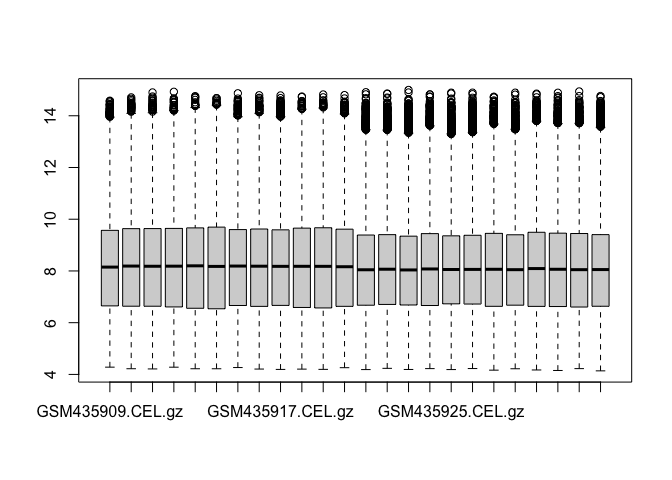<!-- -->

Figure 1. Boxplots of RMA-normalized expression intensities for 24 chips
highlight consistency post-normalization.

``` r
hist(rma_expvalues, breaks=100)
abline(v = 5, col ="red")
```

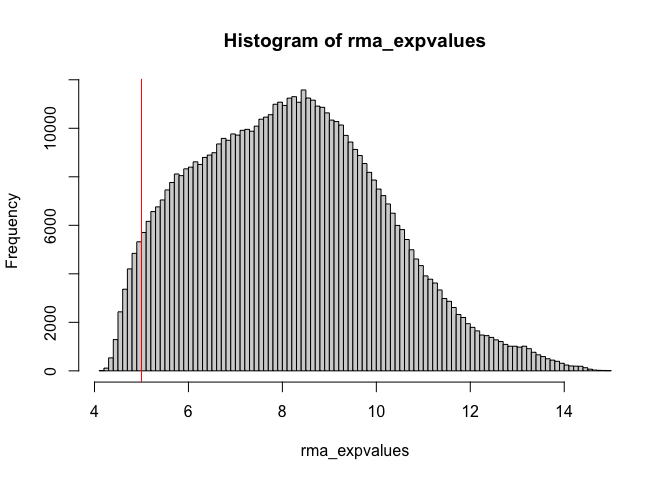<!-- -->

Figure 2. Histogram of Distribution of Normalized Gene Expression Values
with Low Expression Cutoff.

``` r
# filter out values <= 2.3
lowexplogic = rma_expvalues<=5
lowexpsum = apply(lowexplogic,1,sum)
rma_expvalues = rma_expvalues[lowexpsum<5,]
dim(rma_expvalues)
```

    ## [1] 23546    24

## 2. Differentially expressed genes

The study has 3 factors: tissue (Lung and Left Ventricle) and treatment
( treated with PBS versus particulate matters/PM), genotype (wildtype
and CD-1 dominate negative). We will perform ANOVA analysis with aov to
identify differentially expressed genes due to tissue, PM, or
interaction of tissue and PM

``` r
# function to apply anova to each row
expgroupnames = c("expdesign$genotype", "expdesign$tissue", "expdesign$treatment", "expdesign$genotype:expdesign$tissue",          "expdesign$genotype:expdesign$treatment"  ,              
"expdesign$tissue:expdesign$treatment"  ,          
"expdesign$genotype:expdesign$tissue:expdesign$treatment")

myaov = function(expvalues,expgroup1,expgroup2,expgroup3){
  myaov =  aov(expvalues ~ expdesign$genotype * expdesign$tissue *expdesign$treatment)
  aovsum = summary(myaov)
  pvals = aovsum[[1]][["Pr(>F)"]][1:7]
  return (pvals)
}
```

``` r
anovapvalues = apply(rma_expvalues, 1, myaov, expdesign$genotype, expdesign$tissue, expdesign$treatment)
anovapvalues = t(anovapvalues)
colnames(anovapvalues) = expgroupnames
head(anovapvalues)
```

    ##              expdesign$genotype expdesign$tissue expdesign$treatment
    ## 1415670_at         0.0029024802     1.507596e-04         0.415812456
    ## 1415671_at         0.3529344916     6.116699e-11         0.004335285
    ## 1415672_at         0.0002632702     1.548974e-11         0.326667488
    ## 1415673_at         0.2342359015     1.072967e-09         0.351031893
    ## 1415674_a_at       0.3406836100     5.459802e-03         0.701909004
    ## 1415675_at         0.1754704803     2.326982e-07         0.671740999
    ##              expdesign$genotype:expdesign$tissue
    ## 1415670_at                           0.029472859
    ## 1415671_at                           0.003216449
    ## 1415672_at                           0.022906039
    ## 1415673_at                           0.375417439
    ## 1415674_a_at                         0.259801776
    ## 1415675_at                           0.066238512
    ##              expdesign$genotype:expdesign$treatment
    ## 1415670_at                                0.2099578
    ## 1415671_at                                0.4155052
    ## 1415672_at                                0.9219658
    ## 1415673_at                                0.1648534
    ## 1415674_a_at                              0.7728202
    ## 1415675_at                                0.8264748
    ##              expdesign$tissue:expdesign$treatment
    ## 1415670_at                            0.517707348
    ## 1415671_at                            0.005954453
    ## 1415672_at                            0.948548049
    ## 1415673_at                            0.658842898
    ## 1415674_a_at                          0.993370701
    ## 1415675_at                            0.366606800
    ##              expdesign$genotype:expdesign$tissue:expdesign$treatment
    ## 1415670_at                                                0.21368134
    ## 1415671_at                                                0.05204965
    ## 1415672_at                                                0.01319642
    ## 1415673_at                                                0.89520477
    ## 1415674_a_at                                              0.89140421
    ## 1415675_at                                                0.74852268

Adjust p values for multiple hypothesis testing

``` r
# perform fdr correction on p-values

padj = p.adjust(anovapvalues[,3], method = "fdr")
sum(padj<0.05)
```

    ## [1] 1227

``` r
head(padj)
```

    ##   1415670_at   1415671_at   1415672_at   1415673_at 1415674_a_at   1415675_at 
    ##   0.66225987   0.06428125   0.58305888   0.60721400   0.85301416   0.83669136

Identify genes that have a significant fold change

``` r
# function calculating lfc and return the max lfc out of 3 expgroups
mklogfc = function(expvalues, expgroup1, expgroup2, expgroup3) {
  # expgroup1mean = diff(tapply(expvalues, expgroup1, mean))
  # expgroup2mean = diff(tapply(expvalues, expgroup2, mean))
  expgroup3mean = diff(tapply(expvalues, expgroup3, mean))

  return( expgroup3mean)
}
```

``` r
logfcvalues = apply(rma_expvalues, 1, mklogfc, 
                    expdesign$genotype,expdesign$tissue,expdesign$treatment)


head(logfcvalues)
```

    ##   1415670_at   1415671_at   1415672_at   1415673_at 1415674_a_at   1415675_at 
    ##   0.06853003   0.17280253  -0.05121200   0.06841028   0.03146492   0.02181407

``` r
sum(abs(logfcvalues) >= log2(1.5))
```

    ## [1] 270

``` r
# get differentially expressed genes

diffexpgenes = rma_expvalues[abs(logfcvalues) >= log2(1.5) & padj < 0.05,]
colnames(diffexpgenes) = sub("\\..*", "", colnames(diffexpgenes))
head(diffexpgenes)
```

    ##              GSM435909 GSM435910 GSM435911 GSM435912 GSM435913 GSM435914
    ## 1415801_at    6.001426  6.701235  6.541139  5.927920  5.769345  5.450330
    ## 1415922_s_at  8.184307  8.277912  8.206820  9.311998  9.332284  9.791979
    ## 1415997_at   11.206501 12.275935 11.955650 11.499451 10.852739 10.009182
    ## 1416286_at    8.098243  8.145068  8.277468  9.355103  9.386736  9.162557
    ## 1416342_at    6.719835  7.044009  7.059922  8.248492  9.146187  9.854044
    ## 1416456_a_at 10.708032 10.454566 10.984707  9.336536  9.970209  9.661954
    ##              GSM435915 GSM435916 GSM435917 GSM435918 GSM435919 GSM435920
    ## 1415801_at    7.960579  6.997760  7.474310  5.802930  5.563784  6.217406
    ## 1415922_s_at  8.486269  7.573980  8.291380  8.944928  9.662722  9.295901
    ## 1415997_at   12.337024 12.556661 12.516944 11.025341 10.445265 11.315874
    ## 1416286_at    8.154286  8.384841  8.106828  9.147491  9.511854  9.225029
    ## 1416342_at    7.571267  8.456346  7.616523  8.263254 10.060962  9.864279
    ## 1416456_a_at 10.474053 10.278501 10.792120  9.706294  9.498909  8.632417
    ##              GSM435921 GSM435922 GSM435923 GSM435924 GSM435925 GSM435926
    ## 1415801_at   10.695486 11.180041 11.492487 10.855881 11.531649 10.821028
    ## 1415922_s_at  9.836780  9.987619  9.843625  9.788412  9.649566  9.922567
    ## 1415997_at   11.787135 11.746170 11.939707 11.153030 11.892715 11.395929
    ## 1416286_at    7.850238  8.745988  8.141199  8.935609  8.536812  8.475174
    ## 1416342_at    6.397036  6.666031  6.554513  6.366240  6.651706  6.571001
    ## 1416456_a_at  5.879415  5.956113  5.603967  5.881789  6.121638  5.594696
    ##              GSM435927 GSM435928 GSM435929 GSM435930 GSM435931 GSM435932
    ## 1415801_at   10.798380 10.312800 10.729478 10.015227 10.048576 11.135866
    ## 1415922_s_at 10.175670 10.087183  9.811991 10.392888 10.319716 10.270075
    ## 1415997_at   11.082783 11.552603 10.973315 11.605464 10.948210 11.374036
    ## 1416286_at    7.698769  8.692990  8.374336  8.171105  8.217107  7.728248
    ## 1416342_at    6.713569  6.751691  6.603803  6.474947  6.969037  7.621572
    ## 1416456_a_at  5.837883  5.688720  5.716210  5.650972  5.737402  5.477700

``` r
dim(diffexpgenes)
```

    ## [1] 178  24

``` r
plot(logfcvalues, -log10(padj))
```

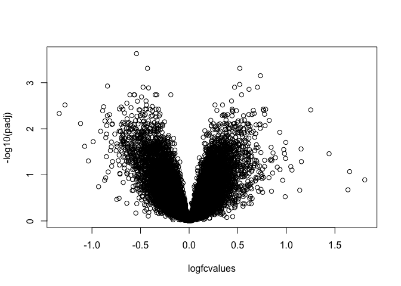<!-- -->

## 3. Cluster differentially expressed genes

Hierarchical clustering

``` r
diffexpval.cor = cor(t(diffexpgenes))
diffexpval.dist = as.dist(1-diffexpval.cor)
diffexpval.clust = hclust(diffexpval.dist, method = "average")
plot(diffexpval.clust)
```

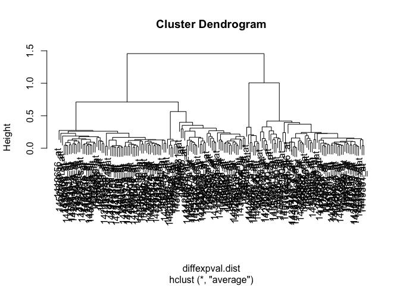<!-- -->

Figure 3. Cluster dendrogram reveals some dominant and other extremely
short groups.

``` r
library(cluster)
# look for optimal groups
avg_sil_width = numeric()
for(i in 2:20){
  tempclust = cutree(diffexpval.clust, k =i)
  avg_sil_width[i] = mean(silhouette(tempclust, diffexpval.dist)[, "sil_width"] )
}

plot(avg_sil_width)
```

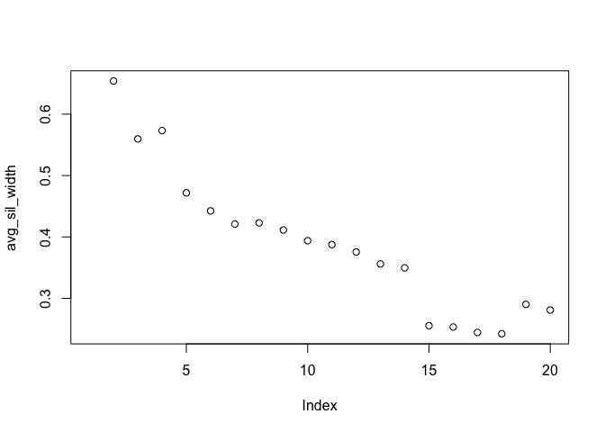<!-- -->

Figure 4. Average silhouette width by index.

From the silhouette width plot, 5 groups look like the optimal
clustering

``` r
diffexp.clust.groups = cutree(diffexpval.clust, k=4)
table(diffexp.clust.groups)
```

    ## diffexp.clust.groups
    ##  1  2  3  4 
    ## 63  8 46 61

``` r
expdesign
```

    ##              sample genotype         tissue treatment
    ## GSM435909 GSM435909       WT           Lung       PBS
    ## GSM435910 GSM435910       WT           Lung       PBS
    ## GSM435911 GSM435911       WT           Lung       PBS
    ## GSM435912 GSM435912       WT           Lung        PM
    ## GSM435913 GSM435913       WT           Lung        PM
    ## GSM435914 GSM435914       WT           Lung        PM
    ## GSM435915 GSM435915   dnCREB           Lung       PBS
    ## GSM435916 GSM435916   dnCREB           Lung       PBS
    ## GSM435917 GSM435917   dnCREB           Lung       PBS
    ## GSM435918 GSM435918   dnCREB           Lung        PM
    ## GSM435919 GSM435919   dnCREB           Lung        PM
    ## GSM435920 GSM435920   dnCREB           Lung        PM
    ## GSM435921 GSM435921       WT Left ventricle       PBS
    ## GSM435922 GSM435922       WT Left ventricle       PBS
    ## GSM435923 GSM435923       WT Left ventricle       PBS
    ## GSM435924 GSM435924       WT Left ventricle        PM
    ## GSM435925 GSM435925       WT Left ventricle        PM
    ## GSM435926 GSM435926       WT Left ventricle        PM
    ## GSM435927 GSM435927   dnCREB Left ventricle       PBS
    ## GSM435928 GSM435928   dnCREB Left ventricle       PBS
    ## GSM435929 GSM435929   dnCREB Left ventricle       PBS
    ## GSM435930 GSM435930   dnCREB Left ventricle        PM
    ## GSM435931 GSM435931   dnCREB Left ventricle        PM
    ## GSM435932 GSM435932   dnCREB Left ventricle        PM

## 4. Heatmap

- Heatmap for all differentially expressed genes

``` r
library(pheatmap)
rownames(expdesign) = expdesign$sample

clustergenes = diffexpgenes
pheatmap(clustergenes,
         annotation_col = expdesign[,2:4],
         cluster_rows = TRUE, 
         cluster_cols = FALSE,
         show_rownames = FALSE,
         scale = "row",
         main = "Heat Map for Differentially Expressed Genes"
         
      
)
```

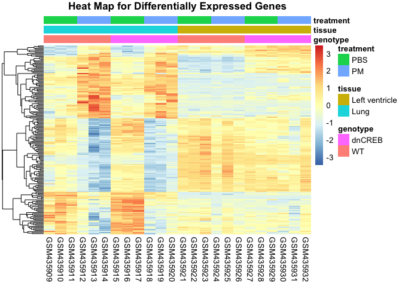<!-- -->

- Heatmap for cluster 1.

``` r
cluster1genes = diffexpgenes[diffexp.clust.groups==1,]

pheatmap(cluster1genes,
         annotation_col = expdesign[,2:4],
         cluster_rows = TRUE, 
         cluster_cols = FALSE,
         show_rownames = FALSE,
         scale = "row",
         main = "Cluster 1 Heat Map"
      
)
```

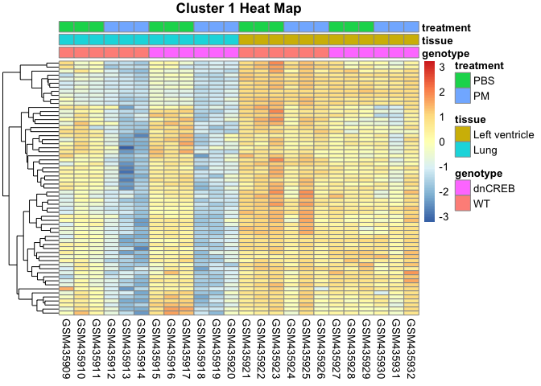<!-- -->

``` r
# PBS vs PM to lung tissue
```

- Heatmap for cluster 2.

``` r
cluster2genes = diffexpgenes[diffexp.clust.groups==4,]

pheatmap(cluster2genes,
          annotation_col = expdesign[,2:4],
         cluster_rows = TRUE, 
         cluster_cols = FALSE,
         show_rownames = FALSE,
         scale = "row",
         main = "Cluster 4 Heat Map"
      
)
```

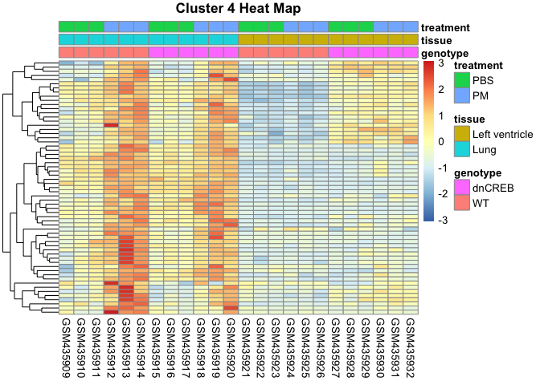<!-- -->

## 5. Go-term analysis

We perform Go-term analysis to identify the biological processes that
the differentially expressed genes are involved with, and whether these
processes are a result of exposure to particulate matter (PM). We will
analyze Go-term on all differentially expressed genes, and those in
cluster 1 and 2.

We use annotation package: mouse4302.db
<https://bioconductor.org/packages/3.18/data/annotation/html/mouse4302.db.html>

``` r
BiocManager::install("GOstats")
```

    ## Bioconductor version 3.18 (BiocManager 1.30.22), R 4.3.1 (2023-06-16)

    ## Warning: package(s) not installed when version(s) same as or greater than current; use
    ##   `force = TRUE` to re-install: 'GOstats'

    ## Old packages: 'BH', 'Biostrings', 'boot', 'brio', 'bslib', 'callr', 'cli',
    ##   'codetools', 'commonmark', 'curl', 'data.table', 'DBI', 'dbplyr', 'desc',
    ##   'DESeq2', 'digest', 'DT', 'emmeans', 'estimability', 'FactoMineR', 'fansi',
    ##   'GenomeInfoDb', 'ggplot2', 'ggrepel', 'glue', 'htmltools', 'httpuv',
    ##   'igraph', 'knitr', 'lattice', 'lme4', 'locfit', 'MASS', 'Matrix',
    ##   'matrixStats', 'metafor', 'mgcv', 'multcompView', 'munsell', 'pkgbuild',
    ##   'pkgload', 'processx', 'promises', 'ps', 'R.oo', 'ragg', 'Rcpp',
    ##   'RcppArmadillo', 'RcppEigen', 'RCurl', 'readr', 'reprex', 'rlang',
    ##   'rmarkdown', 'RSQLite', 'rstudioapi', 'rvest', 'S4Arrays', 'sass', 'sp',
    ##   'SparseArray', 'stringi', 'survival', 'systemfonts', 'tidyr', 'tidyselect',
    ##   'timechange', 'tinytex', 'uuid', 'withr', 'xfun', 'XML', 'yaml', 'zlibbioc'

``` r
BiocManager::install("GO.db")
```

    ## Bioconductor version 3.18 (BiocManager 1.30.22), R 4.3.1 (2023-06-16)

    ## Warning: package(s) not installed when version(s) same as or greater than current; use
    ##   `force = TRUE` to re-install: 'GO.db'

    ## Old packages: 'BH', 'Biostrings', 'boot', 'brio', 'bslib', 'callr', 'cli',
    ##   'codetools', 'commonmark', 'curl', 'data.table', 'DBI', 'dbplyr', 'desc',
    ##   'DESeq2', 'digest', 'DT', 'emmeans', 'estimability', 'FactoMineR', 'fansi',
    ##   'GenomeInfoDb', 'ggplot2', 'ggrepel', 'glue', 'htmltools', 'httpuv',
    ##   'igraph', 'knitr', 'lattice', 'lme4', 'locfit', 'MASS', 'Matrix',
    ##   'matrixStats', 'metafor', 'mgcv', 'multcompView', 'munsell', 'pkgbuild',
    ##   'pkgload', 'processx', 'promises', 'ps', 'R.oo', 'ragg', 'Rcpp',
    ##   'RcppArmadillo', 'RcppEigen', 'RCurl', 'readr', 'reprex', 'rlang',
    ##   'rmarkdown', 'RSQLite', 'rstudioapi', 'rvest', 'S4Arrays', 'sass', 'sp',
    ##   'SparseArray', 'stringi', 'survival', 'systemfonts', 'tidyr', 'tidyselect',
    ##   'timechange', 'tinytex', 'uuid', 'withr', 'xfun', 'XML', 'yaml', 'zlibbioc'

``` r
BiocManager::install("Category")
```

    ## Bioconductor version 3.18 (BiocManager 1.30.22), R 4.3.1 (2023-06-16)

    ## Warning: package(s) not installed when version(s) same as or greater than current; use
    ##   `force = TRUE` to re-install: 'Category'

    ## Old packages: 'BH', 'Biostrings', 'boot', 'brio', 'bslib', 'callr', 'cli',
    ##   'codetools', 'commonmark', 'curl', 'data.table', 'DBI', 'dbplyr', 'desc',
    ##   'DESeq2', 'digest', 'DT', 'emmeans', 'estimability', 'FactoMineR', 'fansi',
    ##   'GenomeInfoDb', 'ggplot2', 'ggrepel', 'glue', 'htmltools', 'httpuv',
    ##   'igraph', 'knitr', 'lattice', 'lme4', 'locfit', 'MASS', 'Matrix',
    ##   'matrixStats', 'metafor', 'mgcv', 'multcompView', 'munsell', 'pkgbuild',
    ##   'pkgload', 'processx', 'promises', 'ps', 'R.oo', 'ragg', 'Rcpp',
    ##   'RcppArmadillo', 'RcppEigen', 'RCurl', 'readr', 'reprex', 'rlang',
    ##   'rmarkdown', 'RSQLite', 'rstudioapi', 'rvest', 'S4Arrays', 'sass', 'sp',
    ##   'SparseArray', 'stringi', 'survival', 'systemfonts', 'tidyr', 'tidyselect',
    ##   'timechange', 'tinytex', 'uuid', 'withr', 'xfun', 'XML', 'yaml', 'zlibbioc'

``` r
BiocManager::install("org.Hs.eg.db")
```

    ## Bioconductor version 3.18 (BiocManager 1.30.22), R 4.3.1 (2023-06-16)

    ## Warning: package(s) not installed when version(s) same as or greater than current; use
    ##   `force = TRUE` to re-install: 'org.Hs.eg.db'

    ## Old packages: 'BH', 'Biostrings', 'boot', 'brio', 'bslib', 'callr', 'cli',
    ##   'codetools', 'commonmark', 'curl', 'data.table', 'DBI', 'dbplyr', 'desc',
    ##   'DESeq2', 'digest', 'DT', 'emmeans', 'estimability', 'FactoMineR', 'fansi',
    ##   'GenomeInfoDb', 'ggplot2', 'ggrepel', 'glue', 'htmltools', 'httpuv',
    ##   'igraph', 'knitr', 'lattice', 'lme4', 'locfit', 'MASS', 'Matrix',
    ##   'matrixStats', 'metafor', 'mgcv', 'multcompView', 'munsell', 'pkgbuild',
    ##   'pkgload', 'processx', 'promises', 'ps', 'R.oo', 'ragg', 'Rcpp',
    ##   'RcppArmadillo', 'RcppEigen', 'RCurl', 'readr', 'reprex', 'rlang',
    ##   'rmarkdown', 'RSQLite', 'rstudioapi', 'rvest', 'S4Arrays', 'sass', 'sp',
    ##   'SparseArray', 'stringi', 'survival', 'systemfonts', 'tidyr', 'tidyselect',
    ##   'timechange', 'tinytex', 'uuid', 'withr', 'xfun', 'XML', 'yaml', 'zlibbioc'

``` r
library(GOstats)
```

    ## Loading required package: Category

    ## Loading required package: stats4

    ## Loading required package: AnnotationDbi

    ## Loading required package: IRanges

    ## Loading required package: S4Vectors

    ## Warning: package 'S4Vectors' was built under R version 4.3.2

    ## 
    ## Attaching package: 'S4Vectors'

    ## The following object is masked from 'package:utils':
    ## 
    ##     findMatches

    ## The following objects are masked from 'package:base':
    ## 
    ##     expand.grid, I, unname

    ## Loading required package: Matrix

    ## 
    ## Attaching package: 'Matrix'

    ## The following object is masked from 'package:S4Vectors':
    ## 
    ##     expand

    ## Loading required package: graph

    ## 

    ## 
    ## Attaching package: 'GOstats'

    ## The following object is masked from 'package:AnnotationDbi':
    ## 
    ##     makeGOGraph

``` r
library(GO.db)
library(Category)
library(org.Hs.eg.db)
```

    ## 

``` r
library(dplyr)
```

    ## 
    ## Attaching package: 'dplyr'

    ## The following object is masked from 'package:graph':
    ## 
    ##     union

    ## The following object is masked from 'package:AnnotationDbi':
    ## 
    ##     select

    ## The following objects are masked from 'package:IRanges':
    ## 
    ##     collapse, desc, intersect, setdiff, slice, union

    ## The following objects are masked from 'package:S4Vectors':
    ## 
    ##     first, intersect, rename, setdiff, setequal, union

    ## The following object is masked from 'package:Biobase':
    ## 
    ##     combine

    ## The following objects are masked from 'package:BiocGenerics':
    ## 
    ##     combine, intersect, setdiff, union

    ## The following objects are masked from 'package:stats':
    ## 
    ##     filter, lag

    ## The following objects are masked from 'package:base':
    ## 
    ##     intersect, setdiff, setequal, union

``` r
BiocManager::install("mouse4302.db")
```

    ## Bioconductor version 3.18 (BiocManager 1.30.22), R 4.3.1 (2023-06-16)

    ## Warning: package(s) not installed when version(s) same as or greater than current; use
    ##   `force = TRUE` to re-install: 'mouse4302.db'

    ## Old packages: 'BH', 'Biostrings', 'boot', 'brio', 'bslib', 'callr', 'cli',
    ##   'codetools', 'commonmark', 'curl', 'data.table', 'DBI', 'dbplyr', 'desc',
    ##   'DESeq2', 'digest', 'DT', 'emmeans', 'estimability', 'FactoMineR', 'fansi',
    ##   'GenomeInfoDb', 'ggplot2', 'ggrepel', 'glue', 'htmltools', 'httpuv',
    ##   'igraph', 'knitr', 'lattice', 'lme4', 'locfit', 'MASS', 'Matrix',
    ##   'matrixStats', 'metafor', 'mgcv', 'multcompView', 'munsell', 'pkgbuild',
    ##   'pkgload', 'processx', 'promises', 'ps', 'R.oo', 'ragg', 'Rcpp',
    ##   'RcppArmadillo', 'RcppEigen', 'RCurl', 'readr', 'reprex', 'rlang',
    ##   'rmarkdown', 'RSQLite', 'rstudioapi', 'rvest', 'S4Arrays', 'sass', 'sp',
    ##   'SparseArray', 'stringi', 'survival', 'systemfonts', 'tidyr', 'tidyselect',
    ##   'timechange', 'tinytex', 'uuid', 'withr', 'xfun', 'XML', 'yaml', 'zlibbioc'

``` r
library(mouse4302.db)
```

    ## Loading required package: org.Mm.eg.db

    ## 

    ## 

``` r
library(AnnotationDbi)
library(annotate)
```

    ## Loading required package: XML

    ## 
    ## Attaching package: 'XML'

    ## The following object is masked from 'package:graph':
    ## 
    ##     addNode

``` r
columns(mouse4302.db)
```

    ##  [1] "ACCNUM"       "ALIAS"        "ENSEMBL"      "ENSEMBLPROT"  "ENSEMBLTRANS"
    ##  [6] "ENTREZID"     "ENZYME"       "EVIDENCE"     "EVIDENCEALL"  "GENENAME"    
    ## [11] "GENETYPE"     "GO"           "GOALL"        "IPI"          "MGI"         
    ## [16] "ONTOLOGY"     "ONTOLOGYALL"  "PATH"         "PFAM"         "PMID"        
    ## [21] "PROBEID"      "PROSITE"      "REFSEQ"       "SYMBOL"       "UNIPROT"

``` r
keytypes(mouse4302.db)
```

    ##  [1] "ACCNUM"       "ALIAS"        "ENSEMBL"      "ENSEMBLPROT"  "ENSEMBLTRANS"
    ##  [6] "ENTREZID"     "ENZYME"       "EVIDENCE"     "EVIDENCEALL"  "GENENAME"    
    ## [11] "GENETYPE"     "GO"           "GOALL"        "IPI"          "MGI"         
    ## [16] "ONTOLOGY"     "ONTOLOGYALL"  "PATH"         "PFAM"         "PMID"        
    ## [21] "PROBEID"      "PROSITE"      "REFSEQ"       "SYMBOL"       "UNIPROT"

``` r
universeID = AnnotationDbi::select(mouse4302.db, 
      keys = rownames(rma_expvalues),
      columns = c("ENTREZID", "ONTOLOGY"))
```

    ## 'select()' returned 1:many mapping between keys and columns

``` r
universeID = dplyr::distinct(universeID, ENTREZID, .keep_all = TRUE)

genelistID = AnnotationDbi::select(mouse4302.db, 
       keys = rownames(diffexpgenes),
       columns = c("ENTREZID", "ONTOLOGY"))
```

    ## 'select()' returned 1:many mapping between keys and columns

``` r
genelistID = dplyr::distinct(genelistID, ENTREZID, .keep_all = TRUE)
```

- GO-term enrichment analysis on all differentially expressed genes

``` r
params = new("GOHyperGParams",
             geneIds = genelistID$ENTREZID,
             universeGeneIds= universeID$ENTREZID,
             annotation = "mouse4302.db",
             ontology = "BP",
             pvalueCutoff=0.001,
            conditional=T,
            testDirection="over")
```

``` r
overRepresented=hyperGTest(params)
```

``` r
GOtermTable = summary(overRepresented)
GOtermTable = GOtermTable[order(-GOtermTable$Count),]
GOtermTable
```

    ##        GOBPID       Pvalue  OddsRatio    ExpCount Count Size
    ## 2  GO:0065007 5.527494e-06   2.277593 99.94285714   126 7524
    ## 6  GO:0032502 3.406473e-05   1.919157 57.07794486    82 4297
    ## 30 GO:0051716 9.721696e-04   1.664268 60.41203008    80 4548
    ## 1  GO:0023052 2.883832e-06   2.109310 50.21052632    78 3780
    ## 3  GO:0007154 5.591042e-06   2.060311 51.00751880    78 3840
    ## 12 GO:0048523 1.650733e-04   1.820513 49.12130326    71 3698
    ## 26 GO:0007275 8.907866e-04   1.706850 44.40576441    63 3343
    ## 25 GO:0042221 6.425482e-04   1.812599 31.60075188    49 2379
    ## 15 GO:0007166 2.502822e-04   1.980897 24.62706767    42 1854
    ## 17 GO:0071310 3.071915e-04   2.086731 18.54335840    34 1396
    ## 23 GO:0009888 5.655644e-04   2.008051 19.16766917    34 1443
    ## 14 GO:0051240 2.202928e-04   2.175438 16.71027569    32 1258
    ## 27 GO:0051049 8.966558e-04   2.004848 17.32130326    31 1304
    ## 10 GO:0044419 1.207849e-04   2.315442 14.71779449    30 1108
    ## 7  GO:0072359 5.296766e-05   2.512489 12.67218045    28  954
    ## 9  GO:0043207 9.418332e-05   2.421425 13.09724311    28  986
    ## 16 GO:0071495 2.562616e-04   2.298964 13.17694236    27  992
    ## 11 GO:0009887 1.413274e-04   2.578404  9.96240602    23  750
    ## 18 GO:0035239 3.088559e-04   2.481000  9.82957393    22  740
    ## 24 GO:0098542 5.805744e-04   2.358217 10.29448622    22  775
    ## 8  GO:0001568 6.039863e-05   2.883850  8.14260652    21  613
    ## 5  GO:0006954 3.013643e-05   3.130536  7.15964912    20  539
    ## 4  GO:0071560 1.644948e-05   4.966343  2.69649123    12  203
    ## 13 GO:0030198 1.749968e-04   4.105888  2.93558897    11  221
    ## 19 GO:0002347 4.786739e-04  12.674194  0.37192982     4   28
    ## 22 GO:1905476 5.495601e-04  12.166194  0.38521303     4   29
    ## 28 GO:0060009 9.305878e-04  18.908654  0.19924812     3   15
    ## 29 GO:0061760 9.305878e-04  18.908654  0.19924812     3   15
    ## 20 GO:0035685 5.214451e-04 150.445860  0.03984962     2    3
    ## 21 GO:1905069 5.214451e-04 150.445860  0.03984962     2    3
    ##                                                                         Term
    ## 2                                                      biological regulation
    ## 6                                                      developmental process
    ## 30                                             cellular response to stimulus
    ## 1                                                                  signaling
    ## 3                                                         cell communication
    ## 12                                   negative regulation of cellular process
    ## 26                                        multicellular organism development
    ## 25                                                      response to chemical
    ## 15                                   cell surface receptor signaling pathway
    ## 17                                    cellular response to organic substance
    ## 23                                                        tissue development
    ## 14                   positive regulation of multicellular organismal process
    ## 27                                                   regulation of transport
    ## 10 biological process involved in interspecies interaction between organisms
    ## 7                                             circulatory system development
    ## 9                                       response to external biotic stimulus
    ## 16                                  cellular response to endogenous stimulus
    ## 11                                                animal organ morphogenesis
    ## 18                                                        tube morphogenesis
    ## 24                                        defense response to other organism
    ## 8                                                   blood vessel development
    ## 5                                                      inflammatory response
    ## 4              cellular response to transforming growth factor beta stimulus
    ## 13                                         extracellular matrix organization
    ## 19                                                    response to tumor cell
    ## 22                   negative regulation of protein localization to membrane
    ## 28                                                  Sertoli cell development
    ## 29                                         antifungal innate immune response
    ## 20                                                  helper T cell diapedesis
    ## 21                                                     allantois development

``` r
# Plot GO term by term, count, p-value
library(ggplot2)
GOtermTable = GOtermTable[1:20,]

ggplot(GOtermTable, aes(y = reorder(GOtermTable$Term, GOtermTable$Count), x = GOtermTable$Count, fill = GOtermTable$Pvalue)) +
  geom_bar(stat = "identity", position = "dodge") +
  scale_fill_gradient(low = "blue", high = "red") + 
  labs(title = "Top 20 GO Terms",
       x = "Count",
       y = "",
       ) +
  theme_minimal() +
  theme(axis.text.x = element_text(angle = 45, hjust = 1))+
   guides(fill = guide_colorbar(title = "P-Value"))
```

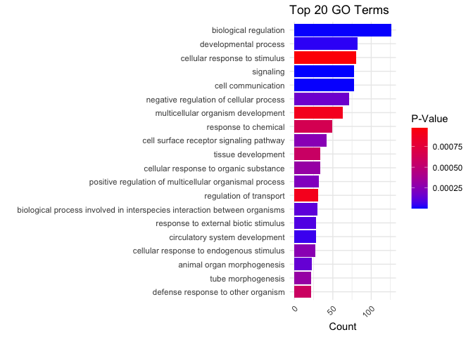<!-- -->

- GO-term enrichment analysis on cluster group 1

``` r
genelistcluster1ID = AnnotationDbi::select(mouse4302.db, 
       keys = rownames(diffexpgenes[diffexp.clust.groups==1,]),
       columns = c("ENTREZID", "ALIAS"))
```

    ## 'select()' returned 1:many mapping between keys and columns

``` r
genelistcluster1ID = dplyr::distinct(genelistcluster1ID, ENTREZID, .keep_all = TRUE)

params = new("GOHyperGParams",
             geneIds = genelistcluster1ID$ENTREZID,
             universeGeneIds= universeID$ENTREZID,
             annotation = "mouse4302.db",
             ontology = "BP",
             pvalueCutoff=0.001,
            conditional=T,
            testDirection="over")

overRepresented=hyperGTest(params)

summary(overRepresented)
```

    ##        GOBPID       Pvalue OddsRatio   ExpCount Count Size
    ## 1  GO:0071417 3.654878e-05  5.686362  2.0883876    10  431
    ## 2  GO:0035020 1.557357e-04 34.142584  0.1065998     3   22
    ## 3  GO:1901698 1.798965e-04  4.013516  3.5807853    12  739
    ## 4  GO:1901652 2.345894e-04  5.512381  1.6668338     8  344
    ## 5  GO:0009719 2.416531e-04  3.364611  5.4947368    15 1134
    ## 6  GO:0022898 3.277817e-04  7.234677  0.9351713     6  193
    ## 7  GO:1905476 3.607260e-04 24.935664  0.1405180     3   29
    ## 8  GO:0031323 4.822924e-04  2.476195 20.2297410    33 4175
    ## 9  GO:0000002 5.312666e-04 21.603636  0.1598997     3   33
    ## 10 GO:0010389 6.552181e-04 11.238367  0.3973266     4   82
    ## 11 GO:0010765 6.881149e-04 19.634711  0.1744361     3   36
    ## 12 GO:1900026 8.074526e-04 18.509610  0.1841270     3   38
    ## 13 GO:0071375 8.285486e-04  6.020604  1.1144528     6  230
    ## 14 GO:0010959 8.372179e-04  5.103067  1.5456976     7  319
    ## 15 GO:1901701 8.453590e-04  3.335749  4.2446115    12  876
    ## 16 GO:0050789 8.824137e-04  2.739773 35.3959900    47 7305
    ## 17 GO:1902531 8.977564e-04  2.930838  6.2118630    15 1282
    ##                                                                  Term
    ## 1                        cellular response to organonitrogen compound
    ## 2                       regulation of Rac protein signal transduction
    ## 3                                       response to nitrogen compound
    ## 4                                                 response to peptide
    ## 5                                     response to endogenous stimulus
    ## 6                    regulation of transmembrane transporter activity
    ## 7             negative regulation of protein localization to membrane
    ## 8                            regulation of cellular metabolic process
    ## 9                                    mitochondrial genome maintenance
    ## 10                regulation of G2/M transition of mitotic cell cycle
    ## 11                        positive regulation of sodium ion transport
    ## 12 positive regulation of substrate adhesion-dependent cell spreading
    ## 13                      cellular response to peptide hormone stimulus
    ## 14                                  regulation of metal ion transport
    ## 15                    cellular response to oxygen-containing compound
    ## 16                                   regulation of biological process
    ## 17                    regulation of intracellular signal transduction

``` r
GOtermTable = summary(overRepresented)
GOtermTable = GOtermTable[order(-GOtermTable$Count),]
GOtermTable
```

    ##        GOBPID       Pvalue OddsRatio   ExpCount Count Size
    ## 16 GO:0050789 8.824137e-04  2.739773 35.3959900    47 7305
    ## 8  GO:0031323 4.822924e-04  2.476195 20.2297410    33 4175
    ## 5  GO:0009719 2.416531e-04  3.364611  5.4947368    15 1134
    ## 17 GO:1902531 8.977564e-04  2.930838  6.2118630    15 1282
    ## 3  GO:1901698 1.798965e-04  4.013516  3.5807853    12  739
    ## 15 GO:1901701 8.453590e-04  3.335749  4.2446115    12  876
    ## 1  GO:0071417 3.654878e-05  5.686362  2.0883876    10  431
    ## 4  GO:1901652 2.345894e-04  5.512381  1.6668338     8  344
    ## 14 GO:0010959 8.372179e-04  5.103067  1.5456976     7  319
    ## 6  GO:0022898 3.277817e-04  7.234677  0.9351713     6  193
    ## 13 GO:0071375 8.285486e-04  6.020604  1.1144528     6  230
    ## 10 GO:0010389 6.552181e-04 11.238367  0.3973266     4   82
    ## 2  GO:0035020 1.557357e-04 34.142584  0.1065998     3   22
    ## 7  GO:1905476 3.607260e-04 24.935664  0.1405180     3   29
    ## 9  GO:0000002 5.312666e-04 21.603636  0.1598997     3   33
    ## 11 GO:0010765 6.881149e-04 19.634711  0.1744361     3   36
    ## 12 GO:1900026 8.074526e-04 18.509610  0.1841270     3   38
    ##                                                                  Term
    ## 16                                   regulation of biological process
    ## 8                            regulation of cellular metabolic process
    ## 5                                     response to endogenous stimulus
    ## 17                    regulation of intracellular signal transduction
    ## 3                                       response to nitrogen compound
    ## 15                    cellular response to oxygen-containing compound
    ## 1                        cellular response to organonitrogen compound
    ## 4                                                 response to peptide
    ## 14                                  regulation of metal ion transport
    ## 6                    regulation of transmembrane transporter activity
    ## 13                      cellular response to peptide hormone stimulus
    ## 10                regulation of G2/M transition of mitotic cell cycle
    ## 2                       regulation of Rac protein signal transduction
    ## 7             negative regulation of protein localization to membrane
    ## 9                                    mitochondrial genome maintenance
    ## 11                        positive regulation of sodium ion transport
    ## 12 positive regulation of substrate adhesion-dependent cell spreading

``` r
# Plot GO term by term, count, p-value
library(ggplot2)

GOtermTable = GOtermTable[1:20,]
ggplot(GOtermTable, aes(y = reorder(GOtermTable$Term, GOtermTable$Count), x = GOtermTable$Count, fill = GOtermTable$Pvalue)) +
  geom_bar(stat = "identity", position = "dodge") +
  scale_fill_gradient(low = "blue", high = "red") + 
  labs(title = "Cluster 1 GO Term Count and P-Value",
       x = "Count",
       y = "",
       ) +
  theme_minimal() +
  theme(axis.text.x = element_text(angle = 45, hjust = 1))+
   guides(fill = guide_colorbar(title = "P-Value"))
```

    ## Warning: Removed 3 rows containing missing values (`geom_bar()`).

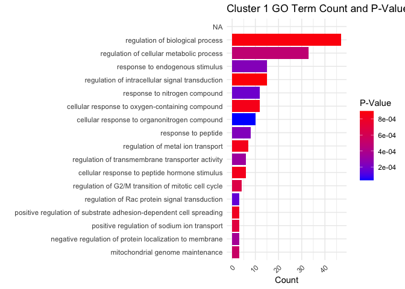<!-- -->

- GO-term enrichment analysis on cluster group 2

``` r
genelistcluster2ID = AnnotationDbi::select(mouse4302.db, 
       keys = rownames(diffexpgenes[diffexp.clust.groups==4,]),
       columns = c("ENTREZID", "ALIAS"))
```

    ## 'select()' returned 1:many mapping between keys and columns

``` r
genelistcluster2ID = dplyr::distinct(genelistcluster2ID, ENTREZID, .keep_all = TRUE)

params = new("GOHyperGParams",
             geneIds = genelistcluster2ID$ENTREZID,
             universeGeneIds= universeID$ENTREZID,
             annotation = "mouse4302.db",
             ontology = "BP",
             pvalueCutoff=0.001,
            conditional=T,
            testDirection="over")

overRepresented=hyperGTest(params)

summary(overRepresented)
```

    ##        GOBPID       Pvalue OddsRatio    ExpCount Count Size
    ## 1  GO:0043207 4.749863e-08  5.813270  4.61286550    19  986
    ## 2  GO:0044419 5.522332e-08  5.527982  5.18362573    20 1108
    ## 3  GO:0002376 4.890706e-06  3.834952  8.14970760    22 1742
    ## 4  GO:0043062 7.882418e-06  9.155712  1.03391813     8  221
    ## 5  GO:0045229 7.882418e-06  9.155712  1.03391813     8  221
    ## 6  GO:0006954 3.279227e-05  5.271296  2.52163743    11  539
    ## 7  GO:0061760 4.240895e-05 56.141509  0.07017544     3   15
    ## 8  GO:0098542 4.802979e-05  5.095723  2.64761179    11  613
    ## 9  GO:0002285 6.786962e-05  9.808333  0.70175439     6  150
    ## 10 GO:0002250 8.130276e-05  6.496644  1.43157895     8  306
    ## 11 GO:0051240 1.423201e-04  3.437037  5.88538012    16 1258
    ## 12 GO:0050896 1.508848e-04  2.833859 25.11812865    39 5369
    ## 13 GO:0006953 1.607434e-04 33.662264  0.10760234     3   23
    ## 14 GO:0019724 1.860867e-04 10.617917  0.53333333     5  114
    ## 15 GO:0031349 1.939167e-04  5.690757  1.62339181     8  347
    ## 16 GO:0022617 2.073776e-04 30.596913  0.11695906     3   25
    ## 17 GO:1905523 2.336509e-04 29.264151  0.12163743     3   26
    ## 18 GO:0032103 2.482449e-04  4.889589  2.14269006     9  458
    ## 19 GO:0002347 2.924548e-04 26.918491  0.13099415     3   28
    ## 20 GO:0042119 3.251204e-04 25.880987  0.13567251     3   29
    ## 21 GO:0072359 3.608323e-04  3.525418  4.46315789    13  954
    ## 22 GO:0002521 3.963794e-04  4.571359  2.28304094     9  488
    ## 23 GO:0050865 4.084161e-04  4.551555  2.29239766     9  490
    ## 24 GO:0002443 4.413664e-04  5.726108  1.38947368     7  297
    ## 25 GO:0002420 4.447136e-04 88.214815  0.03274854     2    7
    ## 26 GO:0001906 4.512841e-04  8.684211  0.64561404     5  138
    ## 27 GO:0002263 4.691101e-04  6.753462  1.00116959     6  214
    ## 28 GO:0001568 4.846649e-04  4.077799  2.86783626    10  613
    ## 29 GO:0007166 4.925592e-04  2.820546  8.67368421    19 1854
    ## 30 GO:0050778 5.014386e-04  4.417408  2.35789474     9  504
    ## 31 GO:0002695 5.310939e-04  8.366013  0.66900585     5  143
    ## 32 GO:0035239 5.384665e-04  3.750495  3.46198830    11  740
    ## 33 GO:0042330 7.011980e-04  5.277525  1.50175439     7  321
    ## 34 GO:0060326 7.019451e-04  6.234133  1.08070175     6  231
    ## 35 GO:0009620 7.285671e-04 19.211321  0.17777778     3   38
    ## 36 GO:0045765 7.343496e-04  6.178150  1.09005848     6  233
    ## 37 GO:0098543 7.577946e-04 63.000000  0.04210526     2    9
    ## 38 GO:0140507 7.577946e-04 63.000000  0.04210526     2    9
    ## 39 GO:0002824 8.489394e-04 10.457118  0.42573099     4   91
    ## 40 GO:0002891 9.115494e-04 17.690169  0.19181287     3   41
    ## 41 GO:0032502 9.335567e-04  2.391247 20.10292398    32 4297
    ## 42 GO:0042742 9.343341e-04  7.341701  0.75789474     5  162
    ## 43 GO:0030098 9.662439e-04  4.983649  1.58596491     7  339
    ## 44 GO:0033003 9.784276e-04 17.235123  0.19649123     3   42
    ##                                                                                                                                                Term
    ## 1                                                                                                              response to external biotic stimulus
    ## 2                                                                         biological process involved in interspecies interaction between organisms
    ## 3                                                                                                                             immune system process
    ## 4                                                                                                              extracellular structure organization
    ## 5                                                                                                     external encapsulating structure organization
    ## 6                                                                                                                             inflammatory response
    ## 7                                                                                                                 antifungal innate immune response
    ## 8                                                                                                                defense response to other organism
    ## 9                                                                                                 lymphocyte activation involved in immune response
    ## 10                                                                                                                         adaptive immune response
    ## 11                                                                                          positive regulation of multicellular organismal process
    ## 12                                                                                                                             response to stimulus
    ## 13                                                                                                                             acute-phase response
    ## 14                                                                                                                         B cell mediated immunity
    ## 15                                                                                                          positive regulation of defense response
    ## 16                                                                                                                 extracellular matrix disassembly
    ## 17                                                                                                      positive regulation of macrophage migration
    ## 18                                                                                             positive regulation of response to external stimulus
    ## 19                                                                                                                           response to tumor cell
    ## 20                                                                                                                            neutrophil activation
    ## 21                                                                                                                   circulatory system development
    ## 22                                                                                                                        leukocyte differentiation
    ## 23                                                                                                                    regulation of cell activation
    ## 24                                                                                                                      leukocyte mediated immunity
    ## 25                                                                     natural killer cell mediated cytotoxicity directed against tumor cell target
    ## 26                                                                                                                                     cell killing
    ## 27                                                                                                      cell activation involved in immune response
    ## 28                                                                                                                         blood vessel development
    ## 29                                                                                                          cell surface receptor signaling pathway
    ## 30                                                                                                           positive regulation of immune response
    ## 31                                                                                                      negative regulation of leukocyte activation
    ## 32                                                                                                                               tube morphogenesis
    ## 33                                                                                                                                            taxis
    ## 34                                                                                                                                  cell chemotaxis
    ## 35                                                                                                                               response to fungus
    ## 36                                                                                                                       regulation of angiogenesis
    ## 37                                                                                                                      detection of other organism
    ## 38                                                                                        granzyme-mediated programmed cell death signaling pathway
    ## 39 positive regulation of adaptive immune response based on somatic recombination of immune receptors built from immunoglobulin superfamily domains
    ## 40                                                                                   positive regulation of immunoglobulin mediated immune response
    ## 41                                                                                                                            developmental process
    ## 42                                                                                                                    defense response to bacterium
    ## 43                                                                                                                       lymphocyte differentiation
    ## 44                                                                                                               regulation of mast cell activation

``` r
GOtermTable = summary(overRepresented)
GOtermTable = GOtermTable[order(-GOtermTable$Count),]
GOtermTable
```

    ##        GOBPID       Pvalue OddsRatio    ExpCount Count Size
    ## 12 GO:0050896 1.508848e-04  2.833859 25.11812865    39 5369
    ## 41 GO:0032502 9.335567e-04  2.391247 20.10292398    32 4297
    ## 3  GO:0002376 4.890706e-06  3.834952  8.14970760    22 1742
    ## 2  GO:0044419 5.522332e-08  5.527982  5.18362573    20 1108
    ## 1  GO:0043207 4.749863e-08  5.813270  4.61286550    19  986
    ## 29 GO:0007166 4.925592e-04  2.820546  8.67368421    19 1854
    ## 11 GO:0051240 1.423201e-04  3.437037  5.88538012    16 1258
    ## 21 GO:0072359 3.608323e-04  3.525418  4.46315789    13  954
    ## 6  GO:0006954 3.279227e-05  5.271296  2.52163743    11  539
    ## 8  GO:0098542 4.802979e-05  5.095723  2.64761179    11  613
    ## 32 GO:0035239 5.384665e-04  3.750495  3.46198830    11  740
    ## 28 GO:0001568 4.846649e-04  4.077799  2.86783626    10  613
    ## 18 GO:0032103 2.482449e-04  4.889589  2.14269006     9  458
    ## 22 GO:0002521 3.963794e-04  4.571359  2.28304094     9  488
    ## 23 GO:0050865 4.084161e-04  4.551555  2.29239766     9  490
    ## 30 GO:0050778 5.014386e-04  4.417408  2.35789474     9  504
    ## 4  GO:0043062 7.882418e-06  9.155712  1.03391813     8  221
    ## 5  GO:0045229 7.882418e-06  9.155712  1.03391813     8  221
    ## 10 GO:0002250 8.130276e-05  6.496644  1.43157895     8  306
    ## 15 GO:0031349 1.939167e-04  5.690757  1.62339181     8  347
    ## 24 GO:0002443 4.413664e-04  5.726108  1.38947368     7  297
    ## 33 GO:0042330 7.011980e-04  5.277525  1.50175439     7  321
    ## 43 GO:0030098 9.662439e-04  4.983649  1.58596491     7  339
    ## 9  GO:0002285 6.786962e-05  9.808333  0.70175439     6  150
    ## 27 GO:0002263 4.691101e-04  6.753462  1.00116959     6  214
    ## 34 GO:0060326 7.019451e-04  6.234133  1.08070175     6  231
    ## 36 GO:0045765 7.343496e-04  6.178150  1.09005848     6  233
    ## 14 GO:0019724 1.860867e-04 10.617917  0.53333333     5  114
    ## 26 GO:0001906 4.512841e-04  8.684211  0.64561404     5  138
    ## 31 GO:0002695 5.310939e-04  8.366013  0.66900585     5  143
    ## 42 GO:0042742 9.343341e-04  7.341701  0.75789474     5  162
    ## 39 GO:0002824 8.489394e-04 10.457118  0.42573099     4   91
    ## 7  GO:0061760 4.240895e-05 56.141509  0.07017544     3   15
    ## 13 GO:0006953 1.607434e-04 33.662264  0.10760234     3   23
    ## 16 GO:0022617 2.073776e-04 30.596913  0.11695906     3   25
    ## 17 GO:1905523 2.336509e-04 29.264151  0.12163743     3   26
    ## 19 GO:0002347 2.924548e-04 26.918491  0.13099415     3   28
    ## 20 GO:0042119 3.251204e-04 25.880987  0.13567251     3   29
    ## 35 GO:0009620 7.285671e-04 19.211321  0.17777778     3   38
    ## 40 GO:0002891 9.115494e-04 17.690169  0.19181287     3   41
    ## 44 GO:0033003 9.784276e-04 17.235123  0.19649123     3   42
    ## 25 GO:0002420 4.447136e-04 88.214815  0.03274854     2    7
    ## 37 GO:0098543 7.577946e-04 63.000000  0.04210526     2    9
    ## 38 GO:0140507 7.577946e-04 63.000000  0.04210526     2    9
    ##                                                                                                                                                Term
    ## 12                                                                                                                             response to stimulus
    ## 41                                                                                                                            developmental process
    ## 3                                                                                                                             immune system process
    ## 2                                                                         biological process involved in interspecies interaction between organisms
    ## 1                                                                                                              response to external biotic stimulus
    ## 29                                                                                                          cell surface receptor signaling pathway
    ## 11                                                                                          positive regulation of multicellular organismal process
    ## 21                                                                                                                   circulatory system development
    ## 6                                                                                                                             inflammatory response
    ## 8                                                                                                                defense response to other organism
    ## 32                                                                                                                               tube morphogenesis
    ## 28                                                                                                                         blood vessel development
    ## 18                                                                                             positive regulation of response to external stimulus
    ## 22                                                                                                                        leukocyte differentiation
    ## 23                                                                                                                    regulation of cell activation
    ## 30                                                                                                           positive regulation of immune response
    ## 4                                                                                                              extracellular structure organization
    ## 5                                                                                                     external encapsulating structure organization
    ## 10                                                                                                                         adaptive immune response
    ## 15                                                                                                          positive regulation of defense response
    ## 24                                                                                                                      leukocyte mediated immunity
    ## 33                                                                                                                                            taxis
    ## 43                                                                                                                       lymphocyte differentiation
    ## 9                                                                                                 lymphocyte activation involved in immune response
    ## 27                                                                                                      cell activation involved in immune response
    ## 34                                                                                                                                  cell chemotaxis
    ## 36                                                                                                                       regulation of angiogenesis
    ## 14                                                                                                                         B cell mediated immunity
    ## 26                                                                                                                                     cell killing
    ## 31                                                                                                      negative regulation of leukocyte activation
    ## 42                                                                                                                    defense response to bacterium
    ## 39 positive regulation of adaptive immune response based on somatic recombination of immune receptors built from immunoglobulin superfamily domains
    ## 7                                                                                                                 antifungal innate immune response
    ## 13                                                                                                                             acute-phase response
    ## 16                                                                                                                 extracellular matrix disassembly
    ## 17                                                                                                      positive regulation of macrophage migration
    ## 19                                                                                                                           response to tumor cell
    ## 20                                                                                                                            neutrophil activation
    ## 35                                                                                                                               response to fungus
    ## 40                                                                                   positive regulation of immunoglobulin mediated immune response
    ## 44                                                                                                               regulation of mast cell activation
    ## 25                                                                     natural killer cell mediated cytotoxicity directed against tumor cell target
    ## 37                                                                                                                      detection of other organism
    ## 38                                                                                        granzyme-mediated programmed cell death signaling pathway

``` r
# Plot GO term by term, count, p-value
library(ggplot2)

GOtermTable = GOtermTable[1:20,]
ggplot(GOtermTable, aes(y = reorder(GOtermTable$Term, GOtermTable$Count), x = GOtermTable$Count, fill = GOtermTable$Pvalue)) +
  geom_bar(stat = "identity", position = "dodge") +
  scale_fill_gradient(low = "blue", high = "red") + 
  labs(title = "Cluster 4 GO Term Count and P-Value",
       x = "Count",
       y = "",
       ) +
  theme_minimal() +
  theme(axis.text.x = element_text(angle = 45, hjust = 1))+
   guides(fill = guide_colorbar(title = "P-Value"))
```

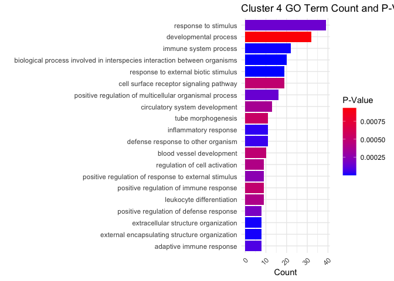<!-- -->
